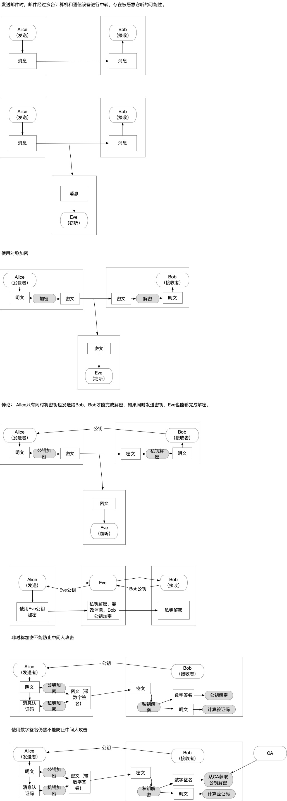

### 不加密

Alice向Bob发送邮件，中间经过服务器转发，可能会被窃听

### 使用对称加密
Alice使用密钥加密消息，发送给Bob，Bob使用密钥解密获得消息。
密钥也需要传输，有被获取的可能性。

### 使用非对称加密
Alice获得Bob的公钥，使用Bob的公钥加密；Bob收到消息后使用自己的私钥解密。
Eve窃听到加密的消息，但是没有Bob的公钥，无法解密获取到消息内容。

#### 非对称加密不能防止中间人攻击
Alice获取Bob公钥，有可能被Eve替换成自己的公钥，Eve去获取Bob的公钥；
Alice使用Eve的公钥加密，发送消息，被Eve拦截，只用自己的私钥解密，获得消息内容；
Eve对消息内容进行篡改，使用Bob公钥加密发送给Bob；
Bob使用自己的私钥解密获得到被Eve篡改的消息。

### 防止消息篡改
Alice使用自己的私钥对消息进行数字签名后发送给Bob，
Bob使用Alice的公钥获得到签名内容，与自己由消息计算得来的内容进行对比，判断消息内容是否被篡改。

#### 数字签名依然不能防止中间人攻击
Bob用来解密数字签名的公钥有可能被替换。

### 使用数字签名和证书
Bob从CA获取Alice签名用的公钥，由于只有Alice有私钥，所以收到的消息，如果签名解密后的内容与计算得到的内容一致，
说明是Alice发送的，并且没有被篡改。

示意图如下：
